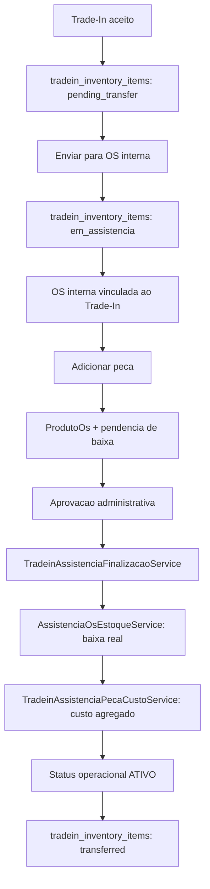

# Trade-In + Assistencia Com Baixa Tardia Design

**Spec**: `.specs/features/tradein-assistencia-baixa-tardia/spec.md`
**Status**: Draft

---

## Architecture Overview

O desenho preserva a assistencia existente em `OrdemServico` e adiciona uma camada pequena de pendencia para pecas de OS interna vinculada a Trade-In. A baixa fisica continua sendo responsabilidade de `AssistenciaOsEstoqueService`; a diferenca e que, para OS interna Trade-In, a chamada a baixa sera adiada ate uma acao administrativa explicita.



---

## Code Reuse Analysis

### Existing Components to Leverage

| Component | Location | How to Use |
| --------- | -------- | ---------- |
| `OrdemServico` | `app/Models/OrdemServico.php` | Reusar OS interna (`escopo_ordem_servico = interna`) e vinculo `tradein_inventory_item_id`. |
| `OrdemServicoController::storeProduto` | `app/Http/Controllers/OrdemServicoController.php` | Aplicar condicional minima apenas para OS interna vinculada a Trade-In. |
| `OrdemServicoController::deletarProduto` | `app/Http/Controllers/OrdemServicoController.php` | Cancelar pendencia antes da baixa; preservar estorno legado para OS normal. |
| `AssistenciaOsEstoqueService` | `app/Services/AssistenciaOsEstoqueService.php` | Continuar como baixa/estorno fisico real, sem mudar semantica global. |
| `TradeinAssistenciaPecaCustoService` | `app/Services/TradeinAssistenciaPecaCustoService.php` | Reusar para custo agregado apos baixa real. |
| `TradeinInventoryItem` | `app/Models/TradeinInventoryItem.php` | Controlar ciclo minimo `pending_transfer -> em_assistencia -> transferred`. |
| `EstoqueStatusService` e `StatusKeyUtil` | `app/Services/EstoqueStatusService.php`, `app/Utils/StatusKeyUtil.php` | Manter bloqueio de venda por status operacional nao-ATIVO e liberacao por `ATIVO`. |

### Integration Points

| System | Integration Method |
| ------ | ------------------ |
| OS de assistencia | Usar OS interna existente com `tradein_inventory_item_id`. |
| Estoque de pecas | Chamar `AssistenciaOsEstoqueService::aplicarBaixa` somente no commit administrativo para novo fluxo. |
| Custo do aparelho Trade-In | Chamar `TradeinAssistenciaPecaCustoService::registrarAposBaixaAssistenciaPeca` apos movimentacao real. |
| Inventario Trade-In | Atualizar `tradein_inventory_items.status` para `em_assistencia` e depois `transferred`. |
| Disponibilidade de venda | Atualizar status operacional do aparelho para `ATIVO` somente apos commit aprovado. |

---

## Components

### AssistenciaOsPecaBaixa

- **Purpose**: Registrar a intencao de baixa de uma linha `produto_os` antes da baixa fisica.
- **Location**: `app/Models/AssistenciaOsPecaBaixa.php`
- **Fields**:
  - `empresa_id`
  - `ordem_servico_id`
  - `produto_os_id`
  - `tradein_inventory_item_id`
  - `status`
  - `deposito_id`
  - `movimentacao_produto_id`
  - `custo_lancamento_id`
  - `aprovado_por_user_id`
  - `baixado_em`
- **Dependencies**: `ProdutoOs`, `OrdemServico`, `TradeinInventoryItem`, `MovimentacaoProduto`.
- **Reuses**: Existing `produto_os` as source of item/quantity/value.

### AssistenciaOsPecaBaixaPendenteService

- **Purpose**: Criar e cancelar pendencias de baixa sem movimentar estoque.
- **Location**: `app/Services/AssistenciaOsPecaBaixaPendenteService.php`
- **Interfaces**:
  - `criarPendente(OrdemServico $ordem, ProdutoOs $linha, ?int $depositoId): AssistenciaOsPecaBaixa`
  - `cancelarPendente(ProdutoOs $linha): void`
  - `pendenciaDaLinha(int $produtoOsId): ?AssistenciaOsPecaBaixa`
- **Dependencies**: `AssistenciaOsPecaBaixa`, `ProdutoOs`, `OrdemServico`.
- **Reuses**: Existing validation already done in `OrdemServicoController::storeProduto`.

### TradeinAssistenciaFinalizacaoService

- **Purpose**: Executar o commit administrativo atomico do pos-reparo.
- **Location**: `app/Services/TradeinAssistenciaFinalizacaoService.php`
- **Interfaces**:
  - `aprovarParaVenda(TradeinInventoryItem $item, OrdemServico $ordem): void`
- **Dependencies**: `AssistenciaOsPecaBaixa`, `AssistenciaOsEstoqueService`, `TradeinAssistenciaPecaCustoService`, `EstoqueStatusService`/status operacional.
- **Reuses**: Baixa real e custo agregado existentes, sem reimplementar regras de estoque.

### TradeinInventoryController Action

- **Purpose**: Expor acao administrativa para enviar Trade-In a assistencia e aprovar para venda.
- **Location**: `app/Http/Controllers/TradeinInventoryController.php`
- **Interfaces**:
  - rota para envio a OS interna
  - rota para aprovacao pos-reparo
- **Dependencies**: `TradeinAssistenciaFinalizacaoService`, `OrdemServico`.
- **Reuses**: Validacoes existentes de OS interna e inventario Trade-In.

---

## Data Models

### `assistencia_os_peca_baixas`

```php
[
    'id' => 'bigint',
    'empresa_id' => 'bigint',
    'ordem_servico_id' => 'bigint',
    'produto_os_id' => 'bigint unique',
    'tradein_inventory_item_id' => 'bigint',
    'status' => 'pendente|baixado|cancelado',
    'deposito_id' => 'bigint nullable',
    'movimentacao_produto_id' => 'bigint nullable',
    'custo_lancamento_id' => 'bigint nullable',
    'aprovado_por_user_id' => 'bigint nullable',
    'baixado_em' => 'timestamp nullable',
]
```

**Relationships**: Pertence a `OrdemServico`, `ProdutoOs`, `TradeinInventoryItem`, `MovimentacaoProduto`.

### `tradein_inventory_items.status`

Estados minimos:

```text
pending_transfer
em_assistencia
transferred
cancelled
```

`transferred` representa que o item saiu da fila administrativa de Trade-In e foi integrado ao estoque real. A disponibilidade para venda e determinada pelo status operacional do estoque (`ATIVO` ou nao).

---

## Error Handling Strategy

| Error Scenario | Handling | User Impact |
| -------------- | -------- | ----------- |
| Commit duplicado | Lock + unique `produto_os_id` + checagem de status `baixado` | Segunda execucao nao duplica baixa/custo. |
| Custo sem baixa | Service de custo chamado somente apos movimentacao real existir | Operacao falha antes de custo se nao houver baixa. |
| Baixa sem ativacao | Mesma transacao encapsula baixa, custo, status do item e ativacao | Rollback total em falha. |
| OS sem vinculo Trade-In | Bloquear commit administrativo | Mensagem de erro operacional. |
| OS nao aprovada (`ap`) | Bloquear commit | Administrador deve aprovar a OS antes. |
| Remocao de peca ja baixada | Bloquear no primeiro incremento | Evita estorno complexo antes de desenho dedicado. |

---

## Tech Decisions

| Decision | Choice | Rationale |
| -------- | ------ | --------- |
| Controle de baixa tardia | Tabela auxiliar | Menor risco que poluir `produto_os` ou criar movimentacao pendente. |
| Movimentacao fisica | Apenas `movimentacao_produtos` real | Relatorios existentes dependem de `os_consumo_peca` como consumo efetivo. |
| Estado Trade-In | `pending_transfer`, `em_assistencia`, `transferred`, `cancelled` | Evita redundancia entre aprovado e transferido. |
| Estado OS no commit | Nao forcar `fz` | Desacopla commit de estoque/custo do encerramento tecnico/financeiro. |
| Escopo do novo comportamento | Somente OS interna com `tradein_inventory_item_id` | Preserva OS normal e legado. |

---

## Compatibility Constraints

- Nao alterar globalmente `AssistenciaOsEstoqueService::aplicarBaixa`.
- Nao alterar globalmente `AssistenciaOsEstoqueService::aplicarEstorno`.
- Nao alterar semantica de `TradeinAssistenciaPecaCustoService`.
- Nao alterar fluxo `ReparoInterno` nesta etapa.
- Nao mudar OS normal: baixa imediata deve continuar.
